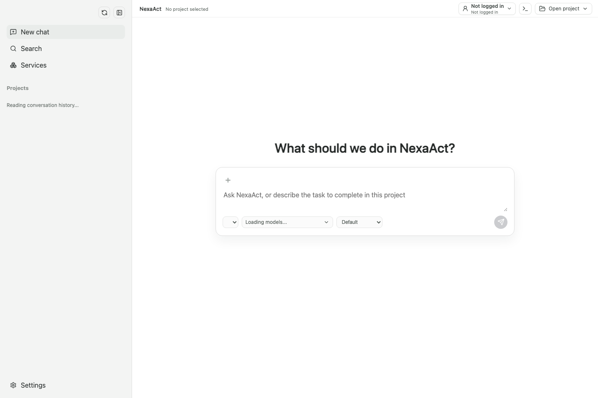
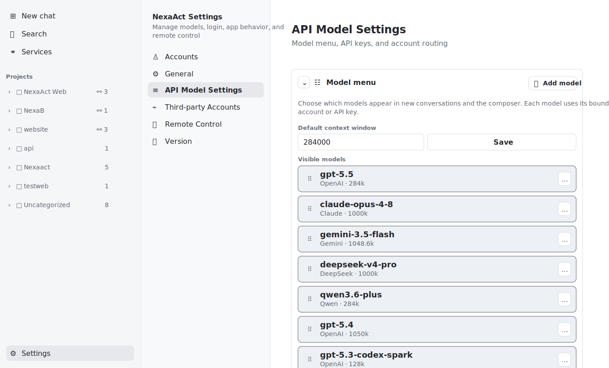
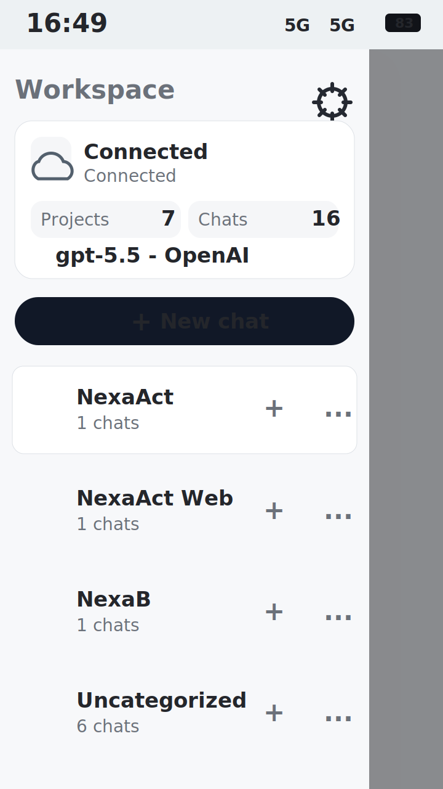
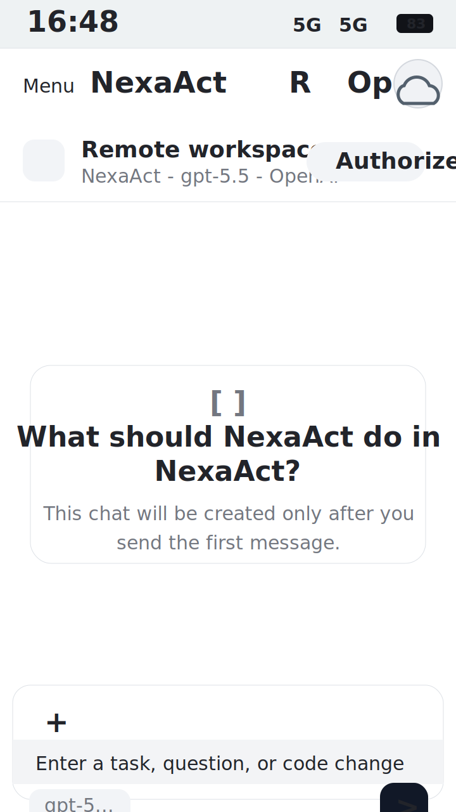
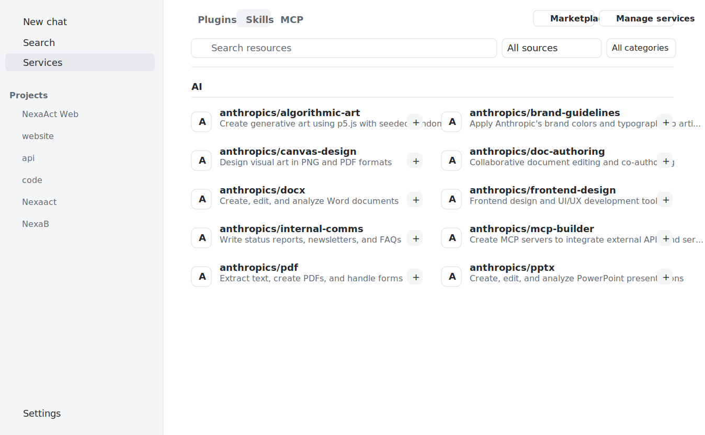

# NexaAct

[English](README.md) | [简体中文](README.zh-CN.md)

NexaAct is an AI Coding desktop app deeply modified from OpenAI Codex. It improves compatibility with third-party APIs so those APIs can also use a high-performance coding tool with strong context management and unified management for plugins, MCP, and skills. It supports logging in to and managing multiple OpenAI, Antigravity, and Claude accounts, provides a fast way to add custom APIs, and includes built-in remote control.



## Key Features

### Multiple Provider Accounts And Any API

NexaAct can manage multiple OpenAI, Antigravity, and Claude accounts in one desktop app, making it easy to switch between different accounts and providers.

NexaAct also supports custom API endpoints, including DeepSeek, Qwen, Claude, Gemini, OpenRouter, or other API providers.



### Built-In Remote Control

NexaAct includes built-in remote control. After signing in with Cloudflare, you can scan a QR code from your phone and use a browser to control and view the working status of NexaAct on your computer. No mobile app download is required.

Remote control is based on your own Cloudflare infrastructure. Your data remains under your control.





### Plugins, Skills, MCP, And Automation

NexaAct is compatible with OpenAI/Codex-style plugin workflows and lets you add, import, and manage skills, plugins, MCP servers, and automation tools from inside the app.



### Multiple Third-Party Account Management

NexaAct supports managing multiple Cloudflare and GitHub accounts, so AI workflows can deploy different projects to different GitHub accounts or Cloudflare accounts as needed.

### Long Conversation UI Optimization

NexaAct reduces rendering pressure for very long conversations by rendering recent turns first and loading earlier history as you scroll up.

### Local Data By Default

All NexaAct workspace data is stored locally on your device. NexaAct does not provide or depend on a centralized hosted backend to store prompts, chats, files, API keys, or workspace history.

## macOS Installation Note

On macOS, the first launch may require manual approval because packaged builds may not be distributed through the Mac App Store.

If macOS blocks the first launch, approve NexaAct from **System Settings > Privacy & Security**, then open the app again. Depending on your macOS version, you may also need to choose **Open Anyway** or confirm that you trust the application.

If macOS says **"NexaAct" is damaged and can't be opened**, the downloaded DMG/app is usually blocked by Gatekeeper quarantine because this build is distributed outside the Mac App Store and may not be Apple-notarized yet.

Move NexaAct to Applications, then run:

```sh
xattr -dr com.apple.quarantine /Applications/NexaAct.app
```

If the DMG itself is blocked before installation, run this on the downloaded file first, then open the DMG again:

```sh
xattr -dr com.apple.quarantine ~/Downloads/NexaAct_0.1.1_aarch64.dmg
```

After that, open NexaAct from Applications. This only removes macOS's download quarantine flag for NexaAct; it does not change your app data or workspace files.

## Current Status

NexaAct is currently under active development, and more features will continue to be improved over time.

Remote control is also still being refined, so some remote features may have bugs.

macOS is the primary development and testing platform for the first release. Windows and Linux versions will be updated and released later:

**jellysugnorina703@gmail.com**
